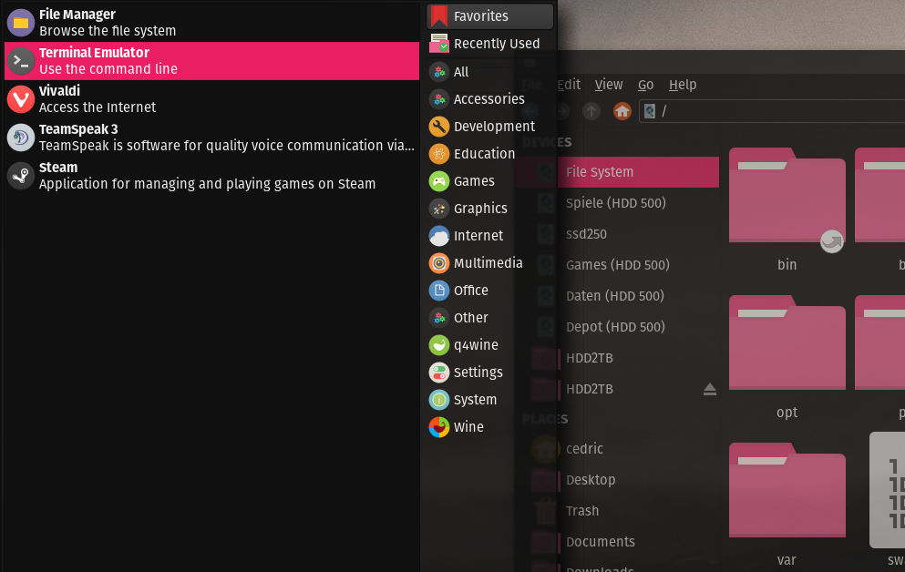
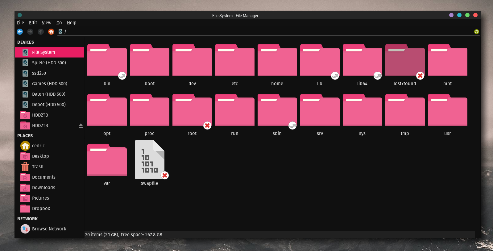
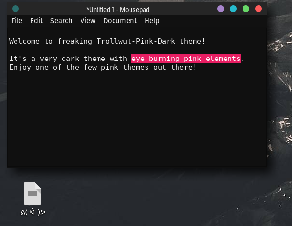

# Trollwut Pink-Dark (gtk theme)

There aren't many pink themes out there, especially dark ones. So I set one up quickly.

It's a very dark one with high-contrast pink (and then shades of that). In the screenshots I use the "Dots Theme" found here: https://www.xfce-look.org/p/1151531/
Used font is "Fira Sans".

It has been tweeked per "Oomox app" and should run on: GTK2, GTK3(.20), Metacity, Openbox, Unity and Xfwm.

As I use Xfce, it is optimized for that. Maybe there are some issues on other platforms. Would be nice if you could confirm how it turns out. :)

